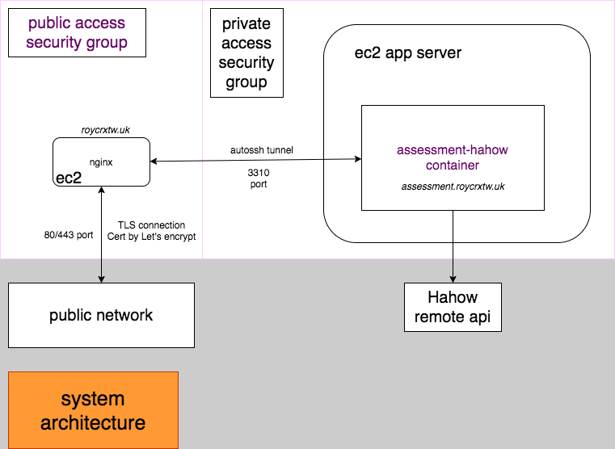
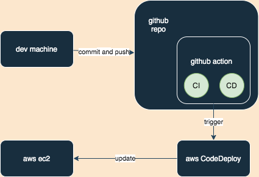

# Assessment-hahow

Assessment project for HaHow.

# Contents

- [API Endpoints](#api-endpoints)
- [Concepts](#concepts)
- [如何跑起來](#如何跑起來)
- [Coding Style](#Coding-Style)
- [關於測試](#關於測試)
- [Issues](#Issues)

# API Endpoints

服務網址: [https://assessment.roycrxtw.uk](https://assessment.roycrxtw.uk)

## A. List Heroes [GET] /heroes

```bash
https://assessment.roycrxtw.uk/heroes

# Request
curl -H "Accept: application/json" -H "Content-Type: application/json" -X GET https://assessment.roycrxtw.uk/heroes
```

## B. Single Hero [GET] /heroes/:heroId

```bash
https://assessment.roycrxtw.uk/heroes/1

curl -H "Accept: application/json" -H "Content-Type: application/json" -X GET https://assessment.roycrxtw.uk/heroes/1
```

## C. Authenticated List Heroes [GET] /heroes

```bash
https://assessment.roycrxtw.uk/heroes

# Request
curl -H "Accept: application/json" -H "Content-Type: application/json" -H "Name: hahow" -H "Password: rocks" -X GET https://assessment.roycrxtw.uk/heroes
```

## D. Authenticated Single Hero [GET] /heroes/:heroId

```bash
https://assessment.roycrxtw.uk/heroes/1

# Request
curl -H "Accept: application/json" -H "Content-Type: application/json" -H "Name: hahow" -H "Password: rocks" -X GET https://assessment.roycrxtw.uk/heroes/1
```

# Concepts

本專案使用 node.js 搭配 `express` 進行 API 服務, service process 透過 `pm2` 進行管理.

log 部分則使用 `pino` 套件達到 log level 管理, 以利在 (需要) production 環境時可以關閉非必要與 debug logs.

文件的部分, 則透過 `apidoc` 進行 API 文件的生成.

## test

使用 jest 框架搭配 sinon 做 unit test. 詳見 [關於測試](#關於測試).


## 系統架構圖

系統架構在個人的 AWS EC2 instance 上, 透過不同的 container 去服務不同的 API services.

在 app server 前面尚有一台架在 ec2 上的 nginx 作為 reverse proxy 以及提供 TLS 連線的功能.



## 部署流程




# 如何跑起來

若有安裝 docker 以及 docker-compose:

```bash
git clone https://github.com/roycrxtw/assessment-hahow.git
cd assessment-hahow
npm run build-image
docker-compose up -d

# container 跑起來後:

echo '嘗試取得 service about 資訊'
curl -X GET http://localhost:3310/about
# response: {"msg":"Hahow Assessment Project by roycrxtw"}

echo '嘗試取得英雄列表'
curl -H "Accept: application/json" -H "Content-Type: application/json" -H "Name: hahow" -H "Password: rocks" -X GET http://localhost:3310/heroes
# response: a hero list
```

若要直接執行, 不使用 docker and docker-compose:

```bash
git clone https://github.com/roycrxtw/assessment-hahow.git
cd assessment-hahow
npm i -g pm2
npm install -y
npm run start-dev

# pm2 跑起來後:

echo '嘗試取得 service about 資訊'
curl -X GET http://localhost:3310/about
# response: {"msg":"Hahow Assessment Project by roycrxtw"}

echo '嘗試取得英雄列表'
curl -H "Accept: application/json" -H "Content-Type: application/json" -H "Name: hahow" -H "Password: rocks" -X GET http://localhost:3310/heroes
# response: a hero list
```

# Coding Style

專案透過 eslint 之輔助, 並設定 airbnb style 來協助 coding style 之一致.

其中有部分 eslint rule 有做客製化設定, 設定可於下列路徑查詢
```bash
<project-root>/.eslintrc.js
```

# 關於測試

測試的部分, 專案中透過 husky 去做 pre-commit 的 hook, 故在開發時 local 執行 commit 皆會觸發 `npm test`.

## Unit-test

單元測試的部分透過 jest 測試框架以及 sinon 來做 dependency stub/fake 去達成隔離 side effect.

## API test

測試時使用 postman 執行 api testing.

## 如何執行測試

```bash
npm test                    # 執行測試
npm run test-coverage       # 生成 coverage 報告
npm run test-coverage-open  # 開啟 coverage html 報告
```

## Coverage

目前測試僅包含 unit-test, 涵蓋到 model 以及 service 部分, coverage 約為:

```js
96.55% Statements 84/87
88.64% Branches 39/44
92.86% Functions 13/14
98.67% Lines 74/75
```

# CI/CD

CI/CD 的部分使用 github action 去達成自動化整合以及部署.


## CI

每次 pull request 皆會觸發 CI workflow, 會對 node.js 12, 14, 16 三個版本執行 unit-test.

## CD

當 push 到 main branch 時將會觸發 CD 流程執行 build image 並 push to AWS ECR 後, 使用 AWS codeDeploy 執行 EC2 instance 之部署.

# Issues

## 遠端 API 模擬不穩定狀態

實作與測試過程中可以發現遠端 hahowAPI 回應有模擬出錯, 故在 API 在設計上存在 retry 機制, 希望在遠端狀態不穩定時,
系統可以直接重新嘗試取得符合規範的 response.

> 目前 retry 設定為 3.

### Why retry?

這邊採用 retry 而非 cache 的想法是希望 API 呈現的結果是直接反映出遠端即時的資料狀態, 例如英雄已經升級為 str 100, 使用者可能希望立刻看到他的結果.
而非快取住的稍微過時的資料. 另外可能這資料再次被讀取的機會很低, cache 的效益就會遞減許多.

但使用 retry 的結果缺點是 API 在回應上會慢了不少, 且可能在 retry 耗盡後依舊無法取得正確結果.

若需求上允許資料稍微不那麼即時的話, 或許採用 cache 機制是一個較佳的方案, 可以有效地提升 API 回應速度.

### Return null or throw error?

`什麼時候會丟出錯誤` 當呼叫遠端 API 時耗盡重試次數, 算是 `服務` 上出了問題, 故是回傳 error.

`什麼時候回傳 null or []` 404 找不到資料時, 在專案中不視為錯誤, 故如果沒有找到結果時會是回傳 [] or null.

另外, 資料檢驗上使用較嚴格的方式確認, 當資料不符合規範時則直接拋棄該資料.


## Axios

過去都是使用 request 套件做 http 請求為主, 但因為該套件已經被標註為 `@deprecated`, 故利用此機會選用另一個使用率亦非常高的套件 `axios`.

### 選用新套件的原則

通常如果有數個功能都很接近的套件需要選擇時, 我會去觀察該套件的下載率, 協作者數目, github 上的 open issue, 專案最後 commit 時間為何以及是否 pass test, 
透過這幾個因素去判斷套件是否合用, 避免套件有問題但其實沒人在維護, 或是社群不活躍有問題很難取得協助.

若有需要時還必須檢驗套件的 license 是否可以使用在商用專案上.

> 所以經過比較後決定嘗試使用 axios.

### Axios 的特別處

這個套件比較特別的是非 200~300 系列的 response 會直接變成錯誤, 故需要特別設定 validateStatus option 去排除 404 類型的回應.

> 想法是 404 找不到資料不代表是一種錯誤, e.g. 搜尋某個關鍵字沒有任何商品不代表有東西壞了, 也不需要去 retry.
